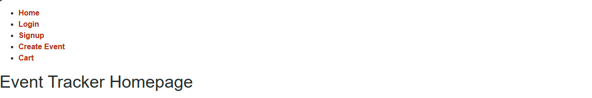

[Description](#description) | [Contributors](#contributors) | [Screenshots](#screenshots) | [Links](#links)

# Description

For this assignment my group was assigned with creating a collaborative MERN-stack single-page application by combining a scalable MongoDB backend, GraphQL API, and an Express.js and Node.jss server with a REACH front end. We also implemented JWT and bcrypt for login security and Stripe for a payment platform.

## Contributors

[Brandon Williams](https://github.com/Bwilliams-88/nexevent-tracker) | [Justin Ramos](https://github.com/Bwilliams-88/nexevent-tracker) | [Christian Diehl](https://github.com/Bwilliams-88/nexevent-tracker) | [Alison Standridge](https://github.com/Bwilliams-88/nexevent-tracker) | [Ella Tran](https://github.com/Bwilliams-88/nexevent-tracker) | [Kamila Montes](https://github.com/Bwilliams-88/nexevent-tracker)

## Screenshots

## Links

[Heroku]()
